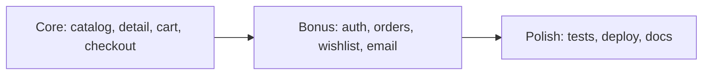
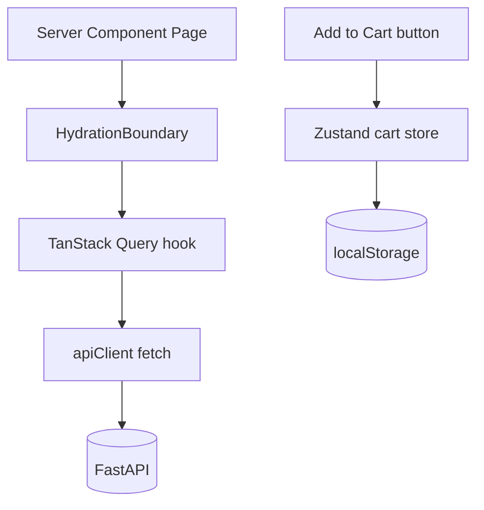
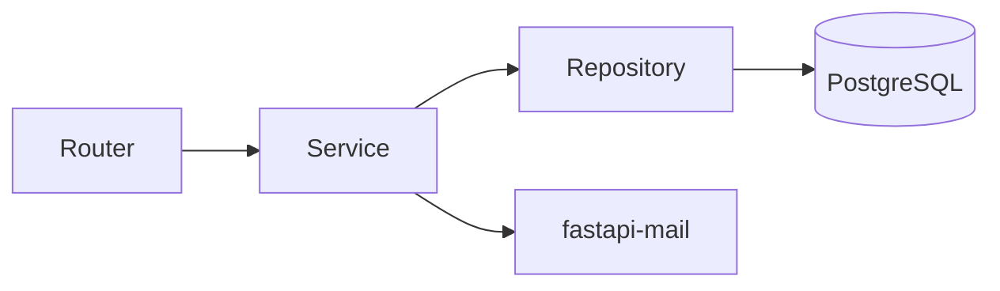
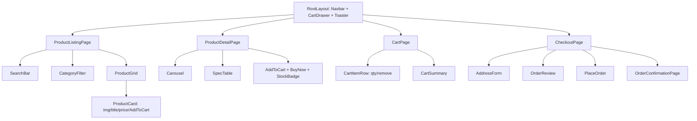

# Amazon Clone — Engineering Design Document

A full-stack e-commerce app. Frontend: Next.js 15 (App Router), TypeScript, Tailwind, ShadCN UI, Zustand, TanStack Query. Backend: FastAPI, SQLAlchemy 2.0, PostgreSQL, Alembic. Monorepo with `frontend/` and `backend/` (both currently empty).

Scope target: completable in ~1 day, but structured to look production-ready. Core features are P0; bonus features (auth, orders history, wishlist, email) are P1 and gated behind feature flags so the build degrades gracefully if time runs short.

## Default Decisions (chosen, not asked)

- Auth: JWT (access token in memory + httpOnly refresh cookie), `passlib[bcrypt]` for hashing.
- Cart: client-side Zustand store with localStorage persistence (guest cart), synced to server on login. Avoids a server round-trip per cart action — fast to build, demo-friendly.
- Email: `fastapi-mail` with SMTP; in dev, log to console (console backend) so no external account needed. Order confirmation only.
- DB: PostgreSQL via Docker Compose locally; Neon for prod.
- Deployment: Vercel (frontend), Render or Railway (backend), Neon (DB).
- Money stored as integer cents (`price_cents`) to avoid float errors.

---

## 1. Project Roadmap



- Phase 0 — Foundation: repo, Docker Compose, FastAPI skeleton, Next.js skeleton, ShadCN init, DB connection, Alembic baseline.
- Phase 1 — Backend core: models, schemas, products + cart + orders endpoints, seed script.
- Phase 2 — Frontend core: listing page, detail page, cart, checkout, order confirmation.
- Phase 3 — Bonus: auth, order history, wishlist, email on order placement.
- Phase 4 — Polish: tests, README, deploy.

---

## 2. Database Schema

```mermaid
erDiagram
  users ||--o{ orders : places
  users ||--o{ wishlist_items : has
  categories ||--o{ products : groups
  products ||--o{ product_images : has
  products ||--o{ order_items : in
  products ||--o{ wishlist_items : in
  orders ||--o{ order_items : contains

  users { uuid id PK; string email UK; string hashed_password; string full_name; datetime created_at }
  categories { uuid id PK; string name UK; string slug UK }
  products { uuid id PK; string title; text description; jsonb specs; int price_cents; string currency; int stock; uuid category_id FK; datetime created_at }
  product_images { uuid id PK; uuid product_id FK; string url; int sort_order }
  orders { uuid id PK; uuid user_id FK; int total_cents; string status; jsonb shipping_address; datetime created_at }
  order_items { uuid id PK; uuid order_id FK; uuid product_id FK; int quantity; int unit_price_cents }
  wishlist_items { uuid id PK; uuid user_id FK; uuid product_id FK; datetime created_at }
```

Notes:
- `products.specs` is JSONB (flexible key/value specifications). `orders.shipping_address` is JSONB (snapshot at purchase time).
- `order_items.unit_price_cents` snapshots price so order history is immutable to later price changes.
- Indexes: `products(category_id)`, `products(title)` (trigram/`ILIKE` for search), unique `(user_id, product_id)` on `wishlist_items`.
- `status` enum: `pending | paid | shipped | delivered | cancelled` (default `pending`).

---

## 3. API Contract

Base path `/api/v1`. JSON everywhere. Errors use `{ "detail": ... }` (FastAPI default). Pagination via `?page=&page_size=`.

- Products
  - `GET /products` — query: `search`, `category`, `page`, `page_size`, `sort`. Returns `{ items: ProductCard[], total, page, page_size }`.
  - `GET /products/{id}` — full product incl. images + specs.
  - `GET /categories` — list for filter UI.
- Cart (optional server sync; primary cart is client-side)
  - `POST /cart/validate` — body `{ items: [{product_id, quantity}] }` → returns priced/stock-checked lines + totals (source of truth at checkout).
- Orders
  - `POST /orders` — body `{ items, shipping_address }` → validates stock + price server-side, decrements stock, creates order, sends email. Returns `Order`.
  - `GET /orders` — auth required; current user's order history.
  - `GET /orders/{id}` — order confirmation/detail.
- Auth (bonus)
  - `POST /auth/register`, `POST /auth/login` (sets refresh cookie, returns access token), `POST /auth/refresh`, `POST /auth/logout`, `GET /auth/me`.
- Wishlist (bonus)
  - `GET /wishlist`, `POST /wishlist/{product_id}`, `DELETE /wishlist/{product_id}` — auth required.

Server is the source of truth for price/stock at `POST /orders` — never trust client totals.

---

## 4. Frontend Architecture

- Next.js 15 App Router. Server Components for data-fetchable pages (listing, detail) with TanStack Query hydration; Client Components for interactive bits (cart drawer, add-to-cart, forms).
- Data layer: a typed `apiClient` (fetch wrapper) + TanStack Query hooks (`useProducts`, `useProduct`, `useCreateOrder`, ...). Query keys centralized.
- Global client state: Zustand for cart + UI (drawer open) + auth session; TanStack Query for all server state. Clear separation: server state never duplicated into Zustand except the cart (intentional offline-first design).
- Styling: Tailwind + ShadCN UI primitives (`button`, `card`, `input`, `sheet`, `dialog`, `carousel`, `badge`, `skeleton`, `form`, `sonner` toasts).



---

## 5. Backend Architecture

Layered (controller → service → repository) for SOLID/testability:

- `api/` (routers) — thin; parse/validate request, call services, shape responses.
- `services/` — business logic (order placement, stock check, pricing, email trigger).
- `repositories/` (or `crud/`) — SQLAlchemy data access, no business rules.
- `models/` — SQLAlchemy ORM. `schemas/` — Pydantic v2 request/response DTOs.
- `core/` — config (`pydantic-settings`), security (JWT/hashing), db session, dependencies.
- Dependency Injection via FastAPI `Depends` (db session, current user, services).



---

## 6. Folder Structure

```text
amazon-clone/
  docker-compose.yml
  README.md
  backend/
    app/
      main.py
      core/        # config, db, security, deps
      models/      # SQLAlchemy
      schemas/     # Pydantic
      api/v1/      # routers: products, categories, cart, orders, auth, wishlist
      services/    # business logic
      repositories/
      utils/       # email, seed
    alembic/       # migrations
    alembic.ini
    pyproject.toml  # or requirements.txt
    tests/
  frontend/
    src/
      app/         # / , /products/[id] , /cart , /checkout , /orders , /login
      components/  # ui/ (shadcn), product/, cart/, layout/
      lib/         # apiClient, queryKeys, utils
      hooks/       # useProducts, useProduct, useCreateOrder ...
      store/       # cart.store.ts, auth.store.ts, ui.store.ts
      types/       # shared TS types mirroring API
    package.json
    tailwind.config.ts
    components.json
```

---

## 7. Component Hierarchy



Reusable primitives: `ProductCard`, `PriceTag`, `QuantityStepper`, `StockBadge`, `EmptyState`, `LoadingSkeleton`.

---

## 8. State Management Strategy

- Server state → TanStack Query (cache, refetch, loading/error states). Hooks colocated in `src/hooks/`.
- Cart → Zustand store persisted to localStorage (`persist` middleware). Actions: `addItem`, `removeItem`, `setQty`, `clear`, derived `subtotalCents`, `count`. On checkout, send to `POST /cart/validate` then `POST /orders`.
- Auth session → Zustand (access token in memory) + refresh via httpOnly cookie. `useAuth` hook hydrates `GET /auth/me`.
- UI state (drawer/dialog open) → small Zustand `ui` store.

Principle: one source of truth per concern; no syncing server data into Zustand except the deliberately client-owned cart.

---

## 9. Development Milestones

- M1 Foundation (≈1h): monorepo, Docker Compose Postgres, FastAPI hello, Next.js + Tailwind + ShadCN init, healthcheck wired.
- M2 Backend Core (≈2h): models + Alembic migration, products/categories/orders endpoints, seed script with ~20 products + images.
- M3 Frontend Core (≈3h): listing (search + filter), detail (carousel/specs/stock), cart, checkout, confirmation.
- M4 Bonus (≈2h): auth (register/login/me), order history, wishlist, order-confirmation email.
- M5 Polish (≈1h): a few tests, README with run instructions, deploy.

---

## 10. Git Commit Plan

Conventional Commits, one logical unit per commit:

```text
chore: init monorepo + docker-compose + tooling
feat(backend): db models, alembic baseline, settings
feat(backend): products + categories endpoints + seed
feat(backend): orders endpoint with stock/price validation
feat(frontend): scaffold app, tailwind, shadcn, apiClient + query setup
feat(frontend): product listing with search and category filter
feat(frontend): product detail with carousel, specs, stock
feat(frontend): cart store + cart page + cart drawer
feat(frontend): checkout flow + order confirmation
feat: auth (register/login/me) [bonus]
feat: order history + wishlist [bonus]
feat: order confirmation email [bonus]
test: backend service + api smoke tests
docs: README, env examples, deploy notes
```

---

## 11. Deployment Plan

- DB: Neon Postgres (free tier). Set `DATABASE_URL`.
- Backend: Render/Railway web service. Start: `uvicorn app.main:app`. Run `alembic upgrade head` on deploy; run seed once. Configure CORS to frontend origin.
- Frontend: Vercel. Env `NEXT_PUBLIC_API_URL`. Auto-deploy from `main`.
- Env files: `.env.example` in both apps; secrets only in platform dashboards.

---

## 12. Testing Strategy

- Backend (pytest + httpx `TestClient`, SQLite or test Postgres): unit-test order service (stock decrement, price validation, out-of-stock rejection); smoke-test each endpoint. Highest-value: `POST /orders` correctness.
- Frontend (Vitest + React Testing Library): unit-test cart store reducers (`addItem`/`setQty`/`subtotal`) and `ProductCard` render. Optional Playwright happy-path: browse → add to cart → checkout → confirmation.
- Keep tests focused on business logic given the 1-day budget.

---

## 13. Detailed Implementation Order

1. `docker-compose.yml` (Postgres) + `.env` files.
2. Backend: `core/config.py`, `core/db.py`, `main.py` with CORS + `/health`.
3. Backend: `models/` → `alembic init` → autogenerate + `upgrade head`.
4. Backend: `schemas/` (Pydantic DTOs) + `repositories/` + `services/`.
5. Backend: routers `products`, `categories`, `orders`; `utils/seed.py`; run seed.
6. Frontend: `create-next-app`, Tailwind, `shadcn init`, add components; `lib/apiClient.ts`, `lib/queryKeys.ts`, `QueryProvider`.
7. Frontend: `types/`, hooks (`useProducts`, `useProduct`, `useCategories`, `useCreateOrder`).
8. Frontend: listing page (grid + search + category filter via query params).
9. Frontend: detail page (carousel, specs table, stock badge, add-to-cart/buy-now).
10. Frontend: `store/cart.store.ts`, cart page, cart drawer in navbar.
11. Frontend: checkout (address form with `react-hook-form` + zod, order review, place order) → confirmation page.
12. Bonus: backend auth + `wishlist` + email; frontend login/register, order history, wishlist toggle.
13. Polish: tests, README, deploy to Vercel + Render + Neon.

---

## Acceptance Criteria (P0)

- Browse products in a grid; search by name; filter by category.
- Open a product, see image carousel, description, specs, stock; add to cart / buy now.
- View cart, change quantity, remove items, see correct subtotal.
- Complete checkout with shipping form, review, place order; see confirmation with order id.
- Server validates stock/price on order placement; stock decrements.